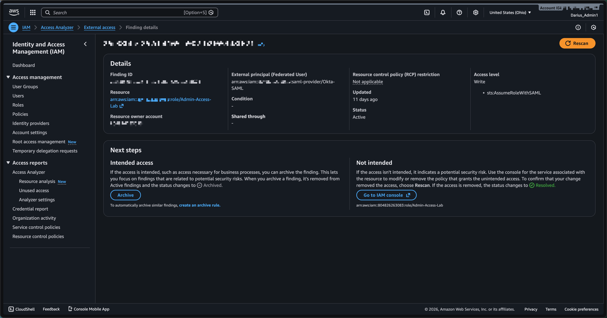

# Security Learning Artifacts (IAM)

**2-year IAM professional** building practical, hands-on labs across Microsoft Entra ID, AWS, Okta, and hybrid identity scenarios. This portfolio demonstrates foundational IAM skills suitable for mid-level Security/IAM Analyst roles.

**What's Inside:** Lab-based implementations documenting configuration decisions, validation steps, and security rationale across multiple platforms - showcasing learning agility and technical execution.

**Focus Areas:** Least privilege, just-in-time access, policy-based controls, compliance frameworks (SOC 2, PCI-DSS, CMMC), and cross-platform IAM concepts.

---

## Featured Labs

### Quick Start (Choose Your Platform)
- **New to IAM?** Start with [Entra Lab 0: Tenant Basics](entra/)
- **Want to see advanced work?** Check out [AWS Service Control Policies](aws-iam-labs/lab1-service-control-policies/) or [Entra PIM Lab](entra/)
- **Interested in federation?** See [Hybrid AD → Entra Connect](hybrid/) or [Okta SSO Build](okta/)

---

## 📸 Portfolio Highlights

**Visual proof of hands-on work across multiple platforms**

### AWS IAM Access Analyzer - Security Monitoring

Organization-wide security monitoring detecting external IAM role access through federated identity. [View full lab →](aws-iam-labs/lab2-iam-access-analyzer/)

### AWS Service Control Policies - Organization Security  

Policy-based access control enforcing MFA across multi-account environment. [View full lab →](aws-iam-labs/lab2-iam-access-analyzer/)

### Okta Lifecycle Automation

Automated user provisioning and deprovisioning with JML workflows. [View full lab →]

### Okta MFA Policy Enforcement

Multi-factor authentication requirements for administrative access. [View full lab →]

---

## Quick Reference
[AWS IAM Commands Cheat Sheet](aws-iam-labs/aws-iam-commands-cheatsheet.md) - Comprehensive CLI reference guide

---

## Artifacts by Platform

### 🔷 AWS (IAM / Security Controls)

**Focus:** Organization-wide security guardrails and policy-based access control

#### [Lab 1: Service Control Policies (SCPs)](aws-iam-labs/lab1-service-control-policies/)

**Lab environment implementing** organization-wide security guardrails that enforce least-privilege access across multi-account environments.

**What I Built:**
- **Require MFA for IAM Actions** - Prevents privilege escalation without multi-factor authentication
- **Deny Root Account Usage** - Effectively disables root account for daily operations

**Skills Demonstrated:**
- AWS Organizations and OU structure design
- Service Control Policy implementation
- IAM policy evaluation logic (deny precedence, default deny)
- CLI-based infrastructure management
- Compliance control implementation (SOC 2, PCI-DSS)

**Real-World Application:** These SCPs enforce the same security principles as Conditional Access in Entra ID - policy-based controls that apply organization-wide, preventing privilege escalation and enforcing MFA.

**Tools Used:** AWS CLI, jq, JSON policy authoring 

---

#### [Lab 2: IAM Access Analyzer](aws-iam-labs/lab2-iam-access-analyzer/)

Organization-wide security monitoring that continuously scans for IAM misconfigurations and external access risks.

**What I Built:**
- Organization-wide IAM Access Analyzer deployment
- Test scenario: Publicly accessible S3 bucket
- Security finding investigation and root cause analysis
- Remediation workflow and verification
- Compliance audit report generation

**Skills Demonstrated:**
- Security monitoring and alerting
- Incident investigation and response
- IAM policy analysis
- Compliance documentation
- CLI-based security operations

**Real-World Application:** 
Continuous detection of IAM risks (similar to Entra ID's Access Reviews) - identifies overly permissive policies, external access, and configuration drift. Critical for SOC 2 compliance and security operations.

**Tools Used:** AWS CLI, IAM Access Analyzer, jq, JSON analysis

**Finding Investigation**
Access Analyzer detected external access to an IAM role through federated identity (Okta SAML):

*External principal (Okta SAML provider) has permission to assume Admin-Access-Lab role. This is intentional for SSO, but Access Analyzer flags it for review as it grants access outside the AWS Organization.*

[View Lab 2](aws-iam-labs/lab2-iam-access-analyzer/)

---

### 🔷 Microsoft Entra ID (IAM / Governance)

**Focus:** Identity governance, privileged access management, and conditional access policies

#### [PIM Lab: Global Administrator as Eligible (JIT Access)](entra/)

Implemented Privileged Identity Management for just-in-time administrative access with approval workflows.

**What I Built:**
- Time-limited Global Administrator role eligibility
- Approval workflow for privilege activation
- Audit trail for administrative access

**Skills Demonstrated:**
- Just-in-time (JIT) privileged access management
- Role-based access control (RBAC) at scale
- Access request and approval workflows
- Audit logging and compliance reporting

**Real-World Application:** Reduces standing admin privileges, limits blast radius of compromised accounts, provides audit trail for compliance (SOC 2, PCI-DSS requirement).

---

#### [Conditional Access MFA Lab](entra/)

Built Conditional Access policies requiring MFA for administrative actions and risky sign-ins.

**What I Built:**
- MFA enforcement for admin roles
- Location-based access restrictions
- Risk-based conditional access

**Skills Demonstrated:**
- Policy-based access control
- Multi-factor authentication enforcement
- Risk assessment and adaptive authentication
- Zero-trust architecture principles

**Real-World Application:** Prevents credential theft from leading to account compromise. Maps directly to AWS IAM condition keys and GCP IAM conditions.

---

#### [Additional Entra Labs](entra/)
- **Sign-in Log Triage Checklist** - Security investigation workflow
- **B2B Guest User & Group-based Access** - External collaboration security
- **Simple SSO to Gallery Application** - SAML/OIDC federation
- **Tenant Basics, Users & Groups** - Foundation setup

---

### 🔷 Okta (IAM / Identity Platform)

**Focus:** Workforce identity, SSO federation, and lifecycle automation

#### [Okta Admin MFA + Lifecycle Automation Lab](okta/)

Implemented automated user lifecycle management with MFA enforcement.

**What I Built:**
- Automated user provisioning/deprovisioning
- MFA enforcement for administrative access
- Lifecycle workflows (Joiner/Mover/Leaver processes)

**Skills Demonstrated:**
- Identity lifecycle automation
- Workflow orchestration
- MFA policy implementation
- Joiner/Mover/Leaver (JML) processes

**Real-World Application:** Reduces manual toil, ensures timely access removal (compliance requirement), enforces MFA for admin actions.

---

#### [Okta SSO Build + Troubleshooting (SAML & OIDC)](okta/)

Built and troubleshot single sign-on integrations using SAML and OIDC protocols.

**What I Built:**
- SAML 2.0 application integration
- OIDC/OAuth 2.0 federation
- SSO troubleshooting workflow

**Skills Demonstrated:**
- Federation protocol implementation (SAML, OIDC)
- Certificate management
- SSO troubleshooting and debugging
- Application integration

**Real-World Application:** Enables secure, centralized authentication for SaaS applications, reduces password sprawl, improves user experience.

---

#### [Additional Okta Labs](okta/)
- **User Lifecycle & Deactivation** - Automated offboarding
- **Org Setup & Basic MFA** - Foundation configuration

---

### 🔷 Hybrid AD → Entra (Identity Synchronization)

**Focus:** On-premises Active Directory integration with cloud identity

#### [Lab 1: On-Prem AD Setup + OU/UPN Prep](hybrid/)

Built on-premises Active Directory environment and prepared for cloud synchronization.

**What I Built:**
- Active Directory domain setup
- Organizational Unit (OU) structure design
- User Principal Name (UPN) suffix configuration
- Pre-sync validation

**Skills Demonstrated:**
- Active Directory fundamentals
- OU design for scoped synchronization
- UPN planning for cloud compatibility
- Infrastructure preparation

**Real-World Application:** Foundation for hybrid identity - many enterprises still have on-prem AD and need to sync to cloud identity providers.

---

#### [Lab 2: Entra Connect (PHS) + Scoped OU Sync + Sign-in Validation](hybrid/)

Implemented Azure AD Connect with Password Hash Synchronization for hybrid identity.

**What I Built:**
- Entra Connect installation and configuration
- Password Hash Sync (PHS) setup
- Scoped synchronization (specific OUs only)
- Sign-in validation and troubleshooting

**Skills Demonstrated:**
- Hybrid identity architecture
- Password hash synchronization
- Selective object synchronization
- Identity federation validation

**Real-World Application:** Enables seamless authentication between on-prem and cloud resources, single identity across environments, critical for most enterprise deployments.

---

## Cross-Platform IAM Concepts

Understanding how identity and access management patterns translate across platforms:

| **Concept** | **Entra ID** | **AWS IAM** | **Okta** |
|------------|-------------|------------|---------|
| **Policy-based access control** | Conditional Access | Service Control Policies | Sign-On Policies |
| **Just-in-time privileged access** | PIM (time-limited roles) | Temporary role elevation | Workflow automation |
| **Periodic access reviews** | Access Reviews | IAM Access Analyzer | Access Certifications |
| **MFA enforcement** | CA policies | IAM condition keys | MFA policies |
| **Organization structure** | Management groups | AWS Organizations | Okta groups |
| **Identity federation** | SAML/OIDC apps | IAM roles for federated access | Universal Directory |
| **Lifecycle automation** | Lifecycle workflows | Lambda + EventBridge | Lifecycle Management |

---

## Skills & Experience (2 Years Hands-On)

### Identity & Access Management
- ✅ Policy-based access control (Conditional Access, SCPs, Sign-On Policies)
- ✅ Least privilege implementation
- ✅ Just-in-time (JIT) privileged access
- ✅ Multi-factor authentication enforcement
- ✅ Role-based access control (RBAC)
- ✅ Identity lifecycle automation (JML processes)

### Governance & Compliance
- ✅ Access reviews and attestation
- ✅ Audit trail collection and analysis
- ✅ SOC 2 Type II control implementation
- ✅ PCI-DSS IAM requirements
- ✅ CMMC framework experience

### Technical Implementation
- ✅ Federation protocols (SAML, OIDC, OAuth)
- ✅ Hybrid identity architecture
- ✅ CLI-based infrastructure management
- ✅ JSON/YAML policy authoring
- ✅ Security log analysis

### Platforms & Tools
- ✅ Microsoft Entra ID (2 years hands-on)
- ✅ AWS IAM & Organizations
- ✅ Okta Workforce Identity
- ✅ Active Directory (on-premises)
- ✅ Azure AD Connect
- ✅ AWS CLI, PowerShell, bash

---

## Lab Scope & Methodology

**Environment:** Lab tenants only - no employer or sensitive data included

**Approach:**
1. Build the control/integration from scratch
2. Document configuration decisions and rationale
3. Validate functionality through testing
4. Create troubleshooting workflows
5. Document for compliance/audit purposes

**Goal:** Demonstrate practical IAM implementation skills that translate to enterprise environments, with emphasis on security, compliance, and operational efficiency.

---

## Planned Labs (Next)

### AWS
- [ ] IP-based access restrictions (Conditional Access equivalent)
- [ ] CloudTrail protection (prevent audit log deletion)
- [ ] Cross-account IAM roles (federated access patterns)
- [ ] IAM Access Analyzer automation
- [ ] Least-privilege policy generation from CloudTrail logs

### Entra ID
- [ ] Break-glass accounts (emergency access)
- [ ] Guest access review with auto-removal
- [ ] Entitlement management (access packages)
- [ ] Authentication strength policies

### Okta
- [ ] Group rules (attribute-driven access automation)
- [ ] Advanced MFA policies
- [ ] API-driven user provisioning

---

## About This Portfolio

Built as part of a career transition from hospitality management to cybersecurity, with focus on Identity and Access Management (IAM). 

**Background:**
- 15 years hospitality leadership (customer service, crisis management, team collaboration)
- 2 years hands-on cybersecurity experience
- Focus on IAM, compliance, and security operations
- Self-directed learning across multiple cloud platforms

### Portfolio Scope

**Lab Environment:** All artifacts built in personal lab tenants for learning and demonstration purposes. No production experience or employer/client data included.

**Experience Level:** 2 years hands-on IAM experience across multiple platforms. This portfolio demonstrates foundational skills and learning agility suitable for mid-level IAM Analyst or Technical Security Analyst roles.

**What This Demonstrates:**
- Hands-on implementation of enterprise security controls
- Multi-cloud IAM knowledge (Entra ID, AWS, Okta)
- Compliance and audit readiness (SOC 2, PCI-DSS, CMMC)
- Technical documentation and knowledge sharing
- Initiative and learning agility

---

## Contact

**GitHub:** [Dfrank77](https://github.com/Dfrank77)

**Portfolio:** [security-learning-artifacts](https://github.com/Dfrank77/security-learning-artifacts)

---

*Last Updated: December 2025*
